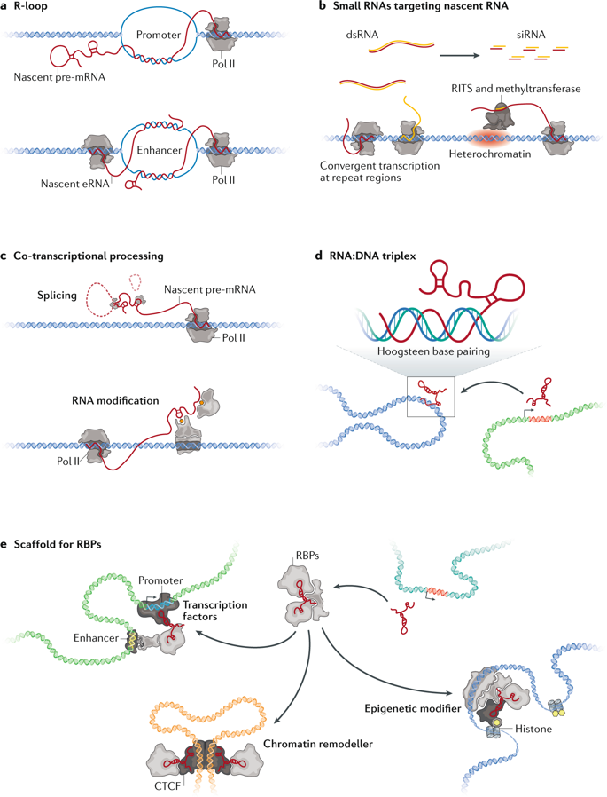
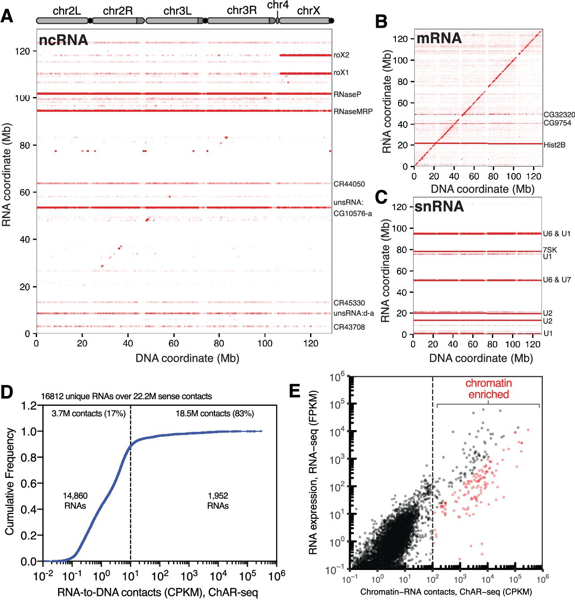
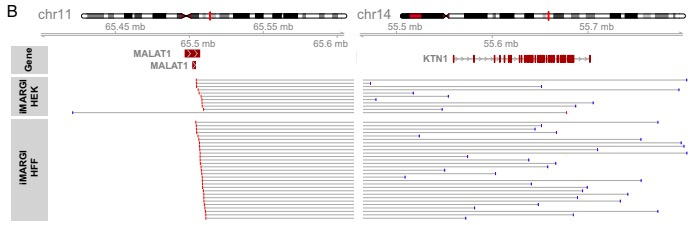
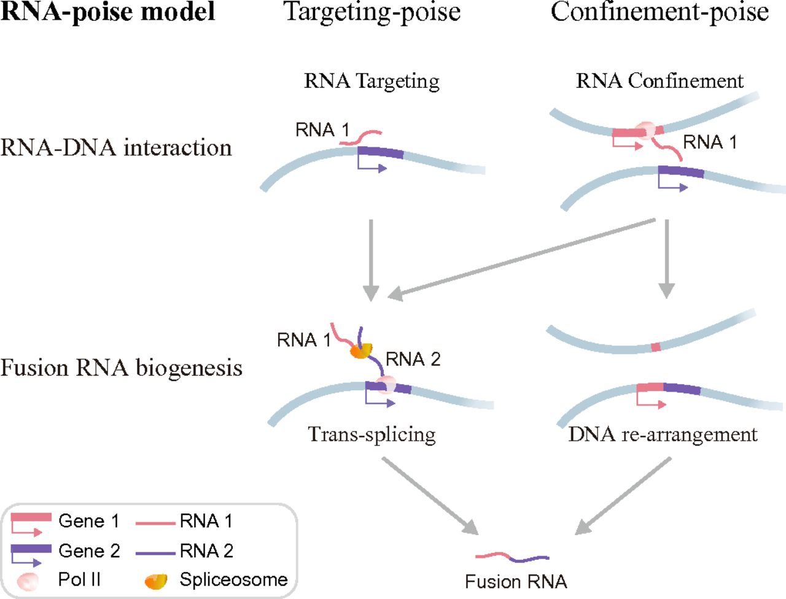

# RNA-Chromatin Interactions

###### Group 17: Aditya Sampath, Blake Gabel, Jacob Doering-Powell

1. [Introduction](#1)
2. [Understanding types of RNA-genome interactions](#2) 
	2.1. [Trans-Acting v. Cis-Acting RNA](#2.1) 
	2.2. [Proximal RNA-genome interactions](#2.2)
3. [Experimental Techniques](#3) 
	3.1. [Methods](#3.1) 
	3.2. [Comparisons to GRID-seq](#3.2)
4. [Impact](#4) 
	4.1. [Epigenetic Impact](#4.1) 
	4.2. [Fusion Transcripts](#4.2)

## 1. Introduction

RNA exists in the cell not only as an intermediary between DNA and the final protein product, but also as non-coding RNAs (ncRNAs), which fulfill biological purposes beyond just DNA transcription. Among these purposes is RNA’s role in RNA-genome interactions, where RNA exists as part of the epigenome [1]. As part of the epigenome, RNA takes part in actions such as gene activation and silencing, on both a local level (via RNA-protein interactions and local DNA interactions), and a global level (where the RNA can modify gene expression levels). These interactions occur both proximally and directly, depending on whether or not the RNA is directly bound to the DNAs. As a result of the variety of different interactions that RNA and DNA can have, new technologies have emerged to map out connections to the genome. These technologies include MARGI (mapping RNA-genome interactions), ChAR-seq (Chromatin Associated RNA sequencing), and GRID-seq (Global RNA Interactions with DNA). Each sequencing technology allows for different information to be learned regarding RNA-genome interactions [1].

## 2. Understanding types of RNA-genome interactions

RNA-genome interactions can be trans-acting or cis-acting. Trans-acting RNA-genome interactions occur when RNA that was synthesized in one part of the genome is moved to a separate location in the genome to interact with those loci. Cis-acting RNA-genome interactions occur when RNA that was synthesized in one part of the genome stays in that location. However, RNA, whether cis or trans, can regulate gene expression. It can positively regulate expression by helping chromatin stay as euchromatin, and it can negatively regulate expression by converting euchromatin to heterochromatin [2].

 
**Figure 1: Different Modes of RNA-Chromatin Interactions. [2]**

### 2.1 Trans-Acting v. Cis-Acting RNA

Cis-acting RNA often occurs due to a mechanism known as R-loop formation, where the RNA is annealed back to the DNA during transcription, forming a RNA-DNA hybrid loop opposite a single strand of DNA. A common type of cis-acting RNAs are protein-coding pre-mRNAs, some of which stay attached to chromatin rather than turn into mature mRNA. Those pre-mRNAs then associate with RNA Polymerase II machinery, and positively regulate transcription [2].

Meanwhile, trans-acting RNA often occurs due to the formation of triplex structures, which occurs when RNA Hoogsteen pairs with the major groove of DNA. Multiple types of long non-coding RNA (lncRNAs) use this type of structure to exert regulatory functions on the DNA. Oftentimes, trans-acting RNA interactions are protein-mediated; a RNA binding protein binds to RNA which has bound to a DNA factor [2].

### 2.2 Proximal RNA-genome interactions

One of the other major characteristics that separate different types of RNA-genome interactions is the proximity between the RNA and the genome that are interacting. Due to the small amount of space in the nucleus, a high number of interactions occur between molecules that aren’t located immediately next to one another. Many of these distant interactions form what’s known as a transcription hub: active gene clusters that are not close in terms of linear chromosomal distance but are folded into close spatial proximity. In general, while the majority of RNA-genome interactions are proximal (within 2000bp of each other on the same chromosome), a still-significant amount are farther away. More specifically, 4% are distal (more than 2000bp away on the same chromosome), and 15-20% are inter-chromosomal, indicating a large number of long-range RNA-DNA interactions [2].

## 3. Experimental Techniques

### 3.1 Methods

There have been several similar technologies developed recently to analyze the interactions between RNA and chromatin, including MARGI, ChAR-seq, and GRID-seq. The overarching method to identify such interactions is similar between these technologies.

The general method is as follows:
1. Crosslink the DNA to any nearby RNA, typically using formaldehyde
2. Ligate the RNA then the DNA to a synthesized linker
	* The linker needs to achieve three goals: one end must selectively bind to RNA and the other to DNA, it must have a means to identify which end bound to RNA or DNA, and it needs a method for capture after fragmentation
3. RNA is reverse transcribed into cDNA, which is necessary for most sequencing techniques
4. The DNA library is fragmented using either sonication or a digestive enzyme
5. Chimeric fragments are captured using the tag on the linker
6. Adapters are added to the fragments which are required for next-generation sequencing
7. Fragments are sequenced and appropriately mapped to either the genome or transcriptome

 
**Figure 2: Graphical overview of sequencing technologies [2]**

As shown in the figure above, the main differences in the technologies lie in the last few steps prior to sequencing. MARGI uses a circularization step followed by a cleavage of the linker to allow for easy identification of RNA/DNA reads after paired-end sequencing. ChAR-seq and GRID-seq are largely the same with the exception of the size selection step that GRID-seq uses to better isolate fragments of interest (labeled MmeI digestion in the figure). They both use long single-end reads rather than paired-end reads like MARGI.

Each method has its own unique pipeline for data analysis. The authors of MARGI developed two RNA-genome maps, one for human embryonic stem cells and one for human embryonic kidney cells. They then compared their maps to known ChIP-seq maps to identify the types of RNA that commonly associate with epigenetic modifications, such as histone methylation and acetylation. They found positive correlations with H3K4me3 and H3K27ac and a negative correlation with H3K9me3 [3]. The authors of GRID-seq took a similar approach, comparing their mapped genome/transcriptome to HiC maps. They found that the majority of RNA associate near transcription start sites, specifically near known promoters and enhancers, and exhibited high levels of tissue specificity. Below is an example of processed ChAR-seq data that maps the relative position of transcribed RNA to its genomic location post-transcription to examine which types or RNA typically exhibit a cis-acting or trans-acting type interaction.

 
**Figure 3: ChAR-seq data [5]**  
**A.** All mapped RNA (y-axis) to genome location (x-axis) **B.** mRNA **C.** snRNA **D.** Cumulative frequency of length-normalized contacts for 16,812 RNAs identified on the ‘RNA-side’ of chimeric reads. **E.** Scatter plot of length normalized chromatin-contacts versus total expression for each RNA

### 3.2 Comparisons to GRID-seq
After developing their new technology, GRID-seq, Zhou and his colleagues compared it to two other recently developed technologies, MARGI and ChAR-seq.

One disadvantage of MARGI is that its circularization step is not specific to the chimeric cDNA-gDNA fragments of interest, allowing for potential gDNA-gDNA fragments to be captured and sequenced. To avoid this error, the GRID-seq analysis pipeline ensures that all RNA reads (cDNA) only map somewhere to the transcribed genic regions [4].

Both GRID-seq and ChAR-seq attempted to normalize for nonspecific RNA interactions, either from free-floating RNA or RNA that associated during library construction. The authors of ChAR-seq added excess free floating RNA and did not include their linker to determine the false positive rate, which they calculated to be approximately 0.5% [5]. The authors of GRID-seq compared experimentally and computationally derived backgrounds on a mixture of human and *D.melanogaster* cells to assess cross-species interactions during library construction. After normalizing the two methods for library size, they concluded that nonspecific contacts overwhelmed specific contacts by genuine trans-acting RNAs. They found that the two derived backgrounds matched, allowing them to develop an accurate statistical model to infer RNA-DNA interactions [4]. GRID-seq uses a digestive enzyme for size selection, only preserving 19-23 bp on either side of the linker. Due to the small size of the reads, efficient mapping becomes more difficult, increasing the rate of false mapping compared to longer reads (20-100 bp) [5].

On paper, ChAR-seq or GRID-seq appear to be the best sequencing method. This is due to the high reported specificity of ChAR-seq, approximately 99.5%; since GRID-seq has a nearly identical method, it likely also has a high specificity rate. However, MARGI will likely be cheaper to implement as it uses paired-end sequencing. The other two technologies use long singled-end sequencing which is a newer, more expensive method.

## 4. Impact

### 4.1 Epigenetic Impact

Epigenetic changes can be thought of as changes that alter expression levels in the genome, but do not alter any DNA. This has implications for proteins that are known to interact with the genome. These are known as transcription factors, which can raise or lower the rate of transcription.

Recently, it has been of interest to study different molecules, such as RNA, that interact with DNA to see their downstream epigenetic affects. Understanding the downstream epigenetic changes of certain RNA-genome interactions, such as X-chromosome dosage compensation, can help scientists figure out how biological processes work and possibly develop new therapeutics based on these interactions.

One well studied example of an ncRNA cis-interaction with chromatin to produce epigenetic changes is Xist. Xist is a ncRNA produced in female mammals from a locus on the X-chromosome [5]. Once it has been produced, it covers the X-chromosome it was produced from and silences further transcription. Another example of a RNA cis-interaction causing epigenetic affects happens in *D.melanogaster*. The lncRNAs roX2 and roX1 are involved in a male-specific lethal (MSL) complex, in which they coat the X-chromosomes in males in order to acetylate the histone H4K16 [5]. Because acetylated histones produce euchromatin, the interaction of the lncRNA increases transcription, essentially doubling transcription.

### 4.2 Fusion Transcripts

Fusion Transcripts are when RNA transcripts get spliced with multiple genes, also known as a fusion gene.

 
**Figure 4: Fusion Transcripts in Genome Browser [6]**

These Fusion transcripts are commonly produced by cancer cells, and because of this, detection of fusion transcripts can be used for prognostic and diagnostic purposes. An example of this is the detection of the PML-RARA fusion transcript that is found in certain types of leukemia. These fusion transcripts are primarily detected from RNA-sequencing or RT-qPCR analysis.

It has been shown that RNA-DNA interactions may lead to the formation of fusion transcripts [6]. The mapping of the fusion transcript sites to the RNA-DNA interaction site was through iMARGI technology, which differs from MARGI because iMARGI carries out ligation in-situ and MARGI does this streptavidin beads [6]. The idea behind this is called the RNA-poise model. 

 
**Figure 5: RNA-Poise Model [6]**

This model reconciles the distance problem of transplicing. The idea is that if a RNA transcript from one gene is close spatially to another while it is being formed, it could be transpliced into the other gene's transcript [6].

## References

[1] Sheng Zhong, BENG 183 3D Genome E-Book

[2] Li, Xiao, and Xiang-Dong Fu. “Chromatin-Associated RNAs as Facilitators of Functional Genomic Interactions.” Nature Reviews Genetics, vol. 20, no. 9, 2019, pp. 503–519., doi:10.1038/s41576-019-0135-1.

[3] Sridhar, Bharat, et al. “Systematic Mapping of RNA-Chromatin Interactions In Vivo.” Current Biology, vol. 27, no. 4, 2017, pp. 602–609., doi:10.1016/j.cub.2017.01.011.

[4] Zhou, Bing, et al. “GRID-Seq for Comprehensive Analysis of Global RNA–Chromatin Interactions.” Nature Protocols, vol. 14, no. 7, 2019, pp. 2036–2068., doi:10.1038/s41596-019-0172-4.

[5] Bell, Jason C, et al. “Chromatin-Associated RNA Sequencing (ChAR-Seq) Maps Genome-Wide RNA-to-DNA Contacts.” ELife, vol. 7, 2018, doi:10.7554/elife.27024.

[6] Yan, Zhangming, et al. “Genome-Wide Colocalization of RNA–DNA Interactions and Fusion RNA Pairs.” Proceedings of the National Academy of Sciences, vol. 116, no. 8, 2019, pp. 3328–3337., doi:10.1073/pnas.1819788116.
