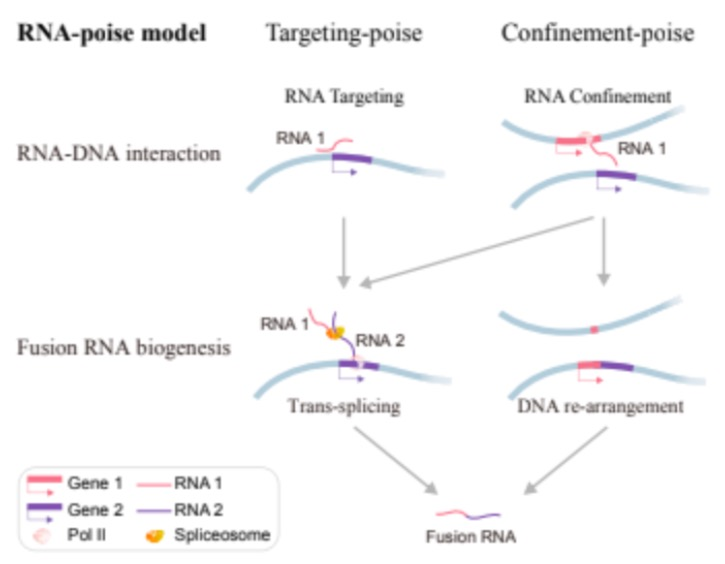

# Impact
## Epigenetic Impact

Epigenetic changes can be thought of as changes that alter expression levels in the genome, but do not alter any DNA. This has implications for proteins that are known to interact with the genome. These are known as transcription factors, and they can raise or lower the rate of transcription. 

Recently, it has been of interest to study different molecules, such as RNA, that interact with DNA to see their downstream epigenetic affects. Understanding the downstream epigenetic changes of certiain RNA-genome interactions, such as X-chromosome dosage compensation, can help humans figure out how biological process work and possibly develop new theraputics based on these interactions. 

One well studied example of a ncRNA cis-interacting with chromatin to produce epigenetic changes is known as Xist. Xist is a ncRNA produced in female mammals from a locus on the X-chromosome [5]. Once it has been produced, it covers the X-chromosome it was produced from and silences further transcription. Another example of a RNA cis-interactions causing epigentic affects happens in D.melanogaster. The lncRNAs roX2 and roX1 are involved in a male-specific lethal (MSL) complex, in which they coat the X-chromosomes in males in order to acetylate the histone H4K16 [5]. Because acetylated euchromatin is open, the interaction of the lncRNA increases transcription, essentially doubling transcription. 

## Fusion Transcripts

Fusion Transcripts are when RNA transcripts get spliced with multiple genes, also known as a fusion gene. Here is an example of what that might look like:
 [fusion transcript](./fusion_gene.jpg "Figure from “Genome-Wide Colocalization of RNA–DNA Interactions and Fusion RNA Pairs.” paper where the mapped read is a a fusion transcript")
These Fusion transcripts are commonly produced by cancer cells, and because of this, detection of fusion transcripts can be used for prognostic and diagnostic purposes. An example of this that molecular diagnostic companies take advantage of is the detection of the PML-RARA fusion transcript that is found in certain types of leukemia. The primary way these fusion transcripts are detected is from RNA-sequencing or RT-qPCR analysis.

It has been shown that RNA-DNA interactions may lead to the formation of fusion transcripts [6]. The mapping of the fusion transcript sites to the RNA-DNA interaction site was through iMARGI technology, where the only difference between MARGI and iMARGI is that iMARGI carries out ligation in-situ and MARGI does this strepdavidin beads [6]. The idea behind this is called the RNA-poise model. 

This model reconciles the distance problem of transplicing. The idea is that if a RNA transcript from one gene is close spatially to another while it is being formed, it could be transpliced into the other gene's transcript [6]. 

