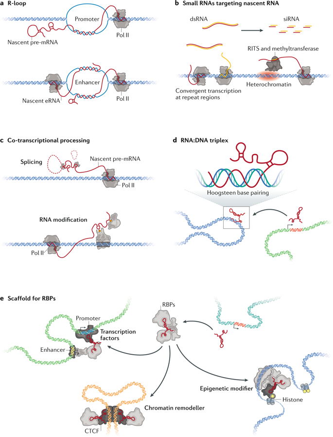

## 2. Understanding types of RNA-genome interactions

RNA-genome interactions can be trans-acting or cis-acting. Trans-acting RNA-genome interactions occur when RNA that was synthesized in one part of the genome is moved to a separate location in the genome to interact with those loci. Cis-acting RNA-genome interactions occur when RNA that was synthesized in one part of the genome stays in that location. However, RNA, whether cis or trans, can regulate gene expression. It can positively regulate expression by helping chromatin stay as euchromatin, and it can negatively regulate expression by converting euchromatin to heterochromatin [2].

 
Figure 1: Different Modes of RNA-Chromatin Interactions. [2]

Cis-acting RNA often occurs due to a mechanism known as R-loop formation, where the RNA is annealed back to the DNA during transcription, forming a RNA-DNA hybrid loop opposite a single strand of DNA. A common type of cis-acting RNAs are protein-coding pre-mRNAs, some of which stay attached to chromatin rather than turn into mature mRNA. Those pre-mRNAs then associate with RNA Polymerase II machinery, and positively regulate transcription [2].

Meanwhile, trans-acting RNA occurs due to the formation of triplex structures, which occurs when RNA Hoogsteen pairs with the major groove of DNA. Multiple types of long non-coding RNA (lncRNAs) use this type of structure to exert regulatory functions on the DNA. Oftentimes, trans-acting RNA interactions are protein-mediated; a RNA binding protein binds to RNA which has bound to a DNA factor [2].

One of the other major characteristics that separate different types of RNA-genome interactions are the proximity between the RNA and the genome that are interacting. Due to the small amount of space in the nucleus, high amounts of interactions occur between molecules that aren’t located immediately next to one another. Many of these distant interactions form what’s known as a transcription hub- active gene clusters that are not close in terms of linear chromosomal distance but are folded into close spatial proximity. In general, while the majority of RNA-genome interactions are proximal (within 2000bp of each other on the same chromosome), a still-significant amount are farther away. More specifically, 4% are distal (more than 2000bp away on the same chromosome), and 15-20% were are inter-chromosomal, indicating a large amount of long range RNA-DNA interactions [2].