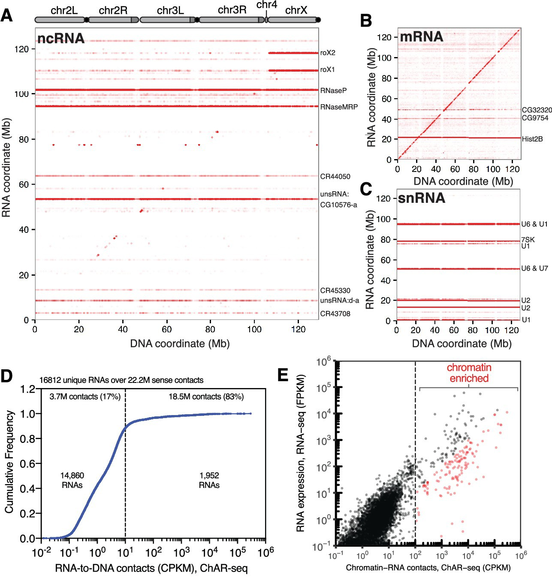

# Experimental Techniques

### Method

There have been several similar technologies developed recently to analyze the interactions between RNA and chromatin, including MARGI, ChAR-seq, and GRID-seq. The overarching method to identify such interactions is surprisingly similar between these technologies.

The general method is as follows:
1. Crosslink the DNA to any nearby RNA, typically using formaldehyde
2. Ligate the RNA then the DNA to a synthesized linker
	* The linker needs to achieve three goals: one end must selectively bind to RNA and the other to DNA, have a means to identify which end bound to RNA or DNA, and a method for capture after fragmentation
3. RNA is reverse transcribed into cDNA, necessary for most sequencing techniques
4. DNA library is fragmented using either sonication or a digestive enzyme
5. Chimeric fragments are captured using the tag on the linker
6. Adapters are added to the fragments which are required for next-generation sequencing
7. Fragments are sequenced and appropriately mapped to either the genome or transcriptome

**Figure 2: Graphical overview [2]**

As shown in the figure above, the main differences in the technologies lie in the last few steps prior to sequencing. MARGI uses a circularization step followed by a cleavage the linker to allow for easy identification of RNA/DNA reads after paired-end sequencing. ChAR-seq and GRID-seq are largely the same with the exception of the size selection step that GRID-seq uses to better isolate fragments of interest (labeled MmeI digestion in the figure). They also both use long single-end reads rather than paired-end reads like MARGI.

Each method has its own unique pipeline for data analysis. MARGI developed two RNA-genome maps, one for human embryonic stem cells and one for human embyronic kidney cells. They then compared their maps to known ChIP-seq maps to identify the types of RNA that commonly associate with epigenetic modifications, such as histone methylation and acetylation. They found positive correlations with H3K4me3 and H3K27ac and a negative correlation with H3K9me3, all associated with heterochromatin [3]. GRID-seq took a similar approach, comparing their mapped genome/transcriptome to HiC maps. They found that the majority of RNA associated near transcription start sites, specifically with known promoters and enhancers, and exhibited high levels of tissue specificity. Below is an example of processed ChAR-seq data that maps the relative position of transcribed RNA to its genomic location post-transcription to examine which types or RNA typically exhibit a cis-acting or trans-acting type interaction.

**Figure 3: ChAR-seq data**  
**A.** All mapped RNA (y-axis) to genome location (x-axis) **B.** mRNA **C.** snRNA **D.** Cumulative frequency of length-normalized contacts for 16,812 RNAs identified on the ‘RNA-side’ of chimeric reads. **E.** Scatter plot of length normalized chromatin-contacts versus total expression for each RNA.  
[5]

### Comparisons to GRID-seq
After developing their new technology, GRID-seq, Zhou and his colleagues compared it to two other recently developed technologies, MARGI and ChAR-seq.

One disadvantage of MARGI is that its circularization step is not specific to the chimeric cDNA-gDNA fragments of interest, allowing for potential gDNA-gDNA fragments to be captured and sequenced. To avoid this error, the GRID-seq analysis pipeline ensures that all RNA reads (cDNA) only map somewhere to the transcribed genic regions [4].

Both GRID-seq and ChAR-seq attempted to normalize for nonspecific RNA interactions, either from free floating RNA or RNA that associated during library construction. The authors of ChAR-seq added excess free floating RNA and did not include their linker to determine the false positive rate, which they calculated to be approximately 0.5% [5]. The authors of GRID-seq compared experimentally and computationally derived backgrounds on a mixture of human and *D.melanogaster* cells to assess cross-species interactions during library construction. After normalizing the two methods for library size, they concluded that nonspecific contacts overwhelmed specific contacts by genuine trans-acting RNAs [4]. They found that the two derived backgrounds matched, allowing them to develop an accurate statistical model to infer RNA-DNA interactions. GRID-seq uses a digestive enzyme for size selection, only preserving 19-23 bp on either side of the linker. Due to the small size of the reads, efficient mapping becomes more difficult, increasing the rate of false mapping compared to longer reads (20-100 bp) [5].

On paper, ChAR-seq or GRID-seq appear to be the best. This is due to the high reported specificity of ChAR-seq, approximately 99.5%; and since GRID-seq has a nearly identical method, it likely also has a high specificity rate. However, MARGI will likely be cheaper to implement as it uses paired-end sequencing. The other two technologies use long singled-end sequencing which is a newer, more expensive method.
